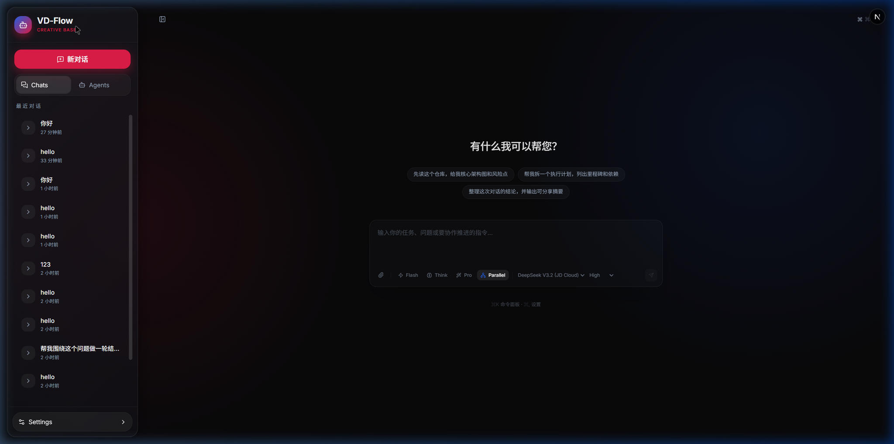

<p align="center">
  
</p>

<h1 align="center">VD-HARNESS</h1>

<p align="center">
  <strong>An open-source SuperAgent harness that researches, codes, and creates.</strong>
</p>

<p align="center">
  <a href="#english">English</a> · <a href="#中文">中文</a>
</p>

---

<a id="english"></a>

## 🌐 English

### What is VD-HARNESS?

VD-HARNESS is an open-source **SuperAgent framework** that researches, codes, and creates. With the help of **sandboxes**, **memories**, **tools**, **skills** and **subagents**, it handles different levels of tasks that could take minutes to hours.

Built on top of LangGraph, VD-HARNESS provides a complete agent runtime with intelligent middleware, parallel subagent orchestration, and a stunning Next.js-based workspace UI.

<p align="center">
  
</p>

### ✨ Key Features

| Feature | Description |
|---------|-------------|
| **🔀 Subagent Parallelism** | Spawn specialized subagents that work in parallel — research, code, and create simultaneously |
| **🛡️ Sandbox Protection** | Every execution runs in thread-isolated sandboxes with secure file isolation |
| **🧠 Persistent Memory** | Cross-session memory with automatic context extraction and injection |
| **⚡ Skill System** | Extensible skills defined via Markdown — from UI/UX design to code review |
| **🛠️ 15+ Built-in Tools** | File I/O, shell commands, browser automation, web search, code analysis |
| **🔗 Multi-Model Support** | OpenAI, Claude, Gemini, DeepSeek, JD Cloud Coding Plan and more |
| **🎛️ Intelligent Middleware** | Context compression, loop detection, guardrails, task management |
| **🖥️ Premium Workspace UI** | Dark glassmorphism design with real-time streaming and artifact management |

<p align="center">
  
</p>

### 🚀 Quick Start

#### Prerequisites

- Python 3.10+
- Node.js 18+
- At least one LLM API key

#### 1. Clone & Install

```bash
git clone https://github.com/qiqi-feeder/VD-HARNESS.git
cd VD-HARNESS

# Backend
pip install -r requirements.txt

# Frontend
cd workspace-frontend
npm install
```

#### 2. Configure

```bash
cp .env.example .env
# Edit .env and add your API keys
```

Edit `config.yaml` to configure your models:

```yaml
models:
  - name: deepseek-v3.2-jd
    display_name: DeepSeek V3.2 (JD Cloud)
    use: langchain_openai:ChatOpenAI
    model: DeepSeek-V3.2
    api_key: $JDCODING_API_KEY
    base_url: https://modelservice.jdcloud.com/coding/openai/v1
    max_tokens: 8192
```

#### 3. Run

```bash
# Terminal 1 — Backend (LangGraph API server)
python run.py

# Terminal 2 — Frontend
cd workspace-frontend
npm run dev
```

Open http://localhost:3000 to see the landing page, click **"Getting Started with vd-flow"** to enter the workspace.

### 📁 Project Structure

```
VD-HARNESS/
├── vdflow/                    # Core Python package
│   ├── agent/                 # Agent implementation
│   │   ├── factory.py         # Agent factory with middleware pipeline
│   │   ├── state.py           # LangGraph state definitions
│   │   └── middlewares/       # Guardrails, compression, loop detection
│   ├── subagents/             # Parallel subagent system
│   ├── memory/                # Persistent memory (SQLite)
│   ├── skills/                # Skill loader & injection
│   ├── tools/                 # Built-in tool implementations
│   ├── config/                # YAML-based configuration
│   └── web/                   # FastAPI + LangGraph API server
├── workspace-frontend/        # Next.js 16 workspace UI
│   ├── app/                   # App router pages
│   ├── components/            # React components
│   │   ├── landing/           # Immersive landing page
│   │   └── workspace/         # Chat, sidebar, settings
│   └── core/                  # API clients & hooks
├── agents/                    # Agent profiles (SOUL.md + config.yaml)
├── skills/                    # Skill definitions (Markdown)
├── config.yaml                # Main configuration
└── run.py                     # Entry point
```

### 🔧 Supported Models

| Provider | Models | Config Key |
|----------|--------|------------|
| OpenAI | GPT-4o, GPT-4o-mini | `$OPENAI_API_KEY` |
| Anthropic | Claude 3.5/4 | `$ANTHROPIC_API_KEY` |
| Google | Gemini 2.0 Flash | `$GOOGLE_API_KEY` |
| DeepSeek | DeepSeek-V3.2+  | `$DEEPSEEK_API_KEY` |
| JD Cloud | DeepSeek, GLM-5, Kimi-K2.5, Qwen3-Coder | `$JDCODING_API_KEY` |

<p align="center">
  
</p>

### 📝 License

MIT License

### 🙏 Acknowledgements

Inspired by [DeerFlow](https://github.com/bytedance/deer-flow) by ByteDance. Rebuilt from the ground up with a focus on simplicity, extensibility, and developer experience.

---

<a id="中文"></a>

## 🇨🇳 中文

### 什么是 VD-HARNESS？

VD-HARNESS 是一个开源的 **SuperAgent 框架**，能够自主研究、编程和创造。借助**沙箱**、**记忆**、**工具**、**技能**和**子智能体**，它可以处理从几分钟到几小时不等的不同层次任务。

基于 LangGraph 构建，VD-HARNESS 提供完整的 Agent 运行时，包含智能中间件、并行子智能体编排，以及精美的 Next.js 工作区界面。

### ✨ 核心特性

| 特性 | 描述 |
|------|------|
| **🔀 子智能体并行** | 生成专用子智能体并行工作 — 同时研究、编码、创造 |
| **🛡️ 沙箱保护** | 每次执行都在线程隔离的沙箱中运行，确保文件安全隔离 |
| **🧠 持久记忆** | 跨会话记忆，自动提取和注入上下文信息 |
| **⚡ 技能系统** | 通过 Markdown 文件定义可扩展技能 — 从 UI/UX 设计到代码审查 |
| **🛠️ 15+ 内置工具** | 文件读写、Shell 命令、浏览器自动化、网页搜索、代码分析 |
| **🔗 多模型支持** | OpenAI、Claude、Gemini、DeepSeek、京东云 Coding Plan 等 |
| **🎛️ 智能中间件** | 上下文压缩、循环检测、安全护栏、任务管理 |
| **🖥️ 精美工作区 UI** | 暗色玻璃拟态设计，实时流式输出与产物管理 |

### 🚀 快速开始

#### 环境要求

- Python 3.10+
- Node.js 18+
- 至少一个 LLM API 密钥

#### 1. 克隆与安装

```bash
git clone https://github.com/qiqi-feeder/VD-HARNESS.git
cd VD-HARNESS

# 后端
pip install -r requirements.txt

# 前端
cd workspace-frontend
npm install
```

#### 2. 配置

```bash
cp .env.example .env
# 编辑 .env 添加你的 API 密钥
```

编辑 `config.yaml` 配置模型：

```yaml
models:
  - name: deepseek-v3.2-jd
    display_name: DeepSeek V3.2 (JD Cloud)
    use: langchain_openai:ChatOpenAI
    model: DeepSeek-V3.2
    api_key: $JDCODING_API_KEY
    base_url: https://modelservice.jdcloud.com/coding/openai/v1
    max_tokens: 8192
```

#### 3. 运行

```bash
# 终端 1 — 后端 (LangGraph API 服务器)
python run.py

# 终端 2 — 前端
cd workspace-frontend
npm run dev
```

打开 http://localhost:3000 查看落地页，点击 **"Getting Started with vd-flow"** 进入工作区。

### 🔧 支持的模型

| 提供商 | 模型 | 配置密钥 |
|--------|------|----------|
| OpenAI | GPT-4o, GPT-4o-mini | `$OPENAI_API_KEY` |
| Anthropic | Claude 3.5/4 | `$ANTHROPIC_API_KEY` |
| Google | Gemini 2.0 Flash | `$GOOGLE_API_KEY` |
| DeepSeek | DeepSeek-V3.2+ | `$DEEPSEEK_API_KEY` |
| 京东云 | DeepSeek, GLM-5, Kimi-K2.5, Qwen3-Coder | `$JDCODING_API_KEY` |

### 📝 添加自定义技能

在 `skills/custom/` 下创建目录和 `SKILL.md`：

```markdown
---
name: my-skill
description: A custom skill for specific tasks
enabled: true
---

# My Custom Skill

Instructions for the agent to follow when using this skill.
```

重启服务后技能自动加载并注入到 Agent 系统提示中。

### 📄 许可证

MIT License

### 🙏 致谢

受 [DeerFlow](https://github.com/bytedance/deer-flow)（ByteDance）启发，从零重构，专注于简洁性、可扩展性和开发者体验。
