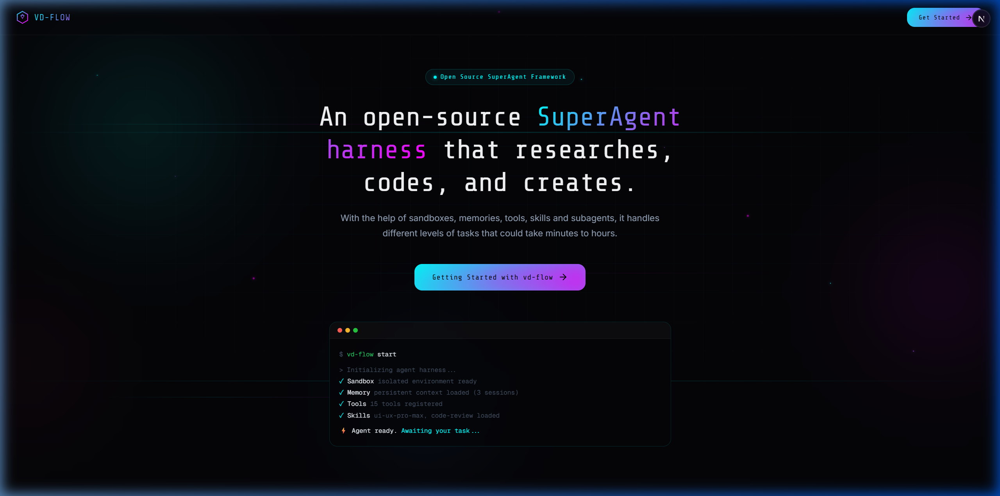
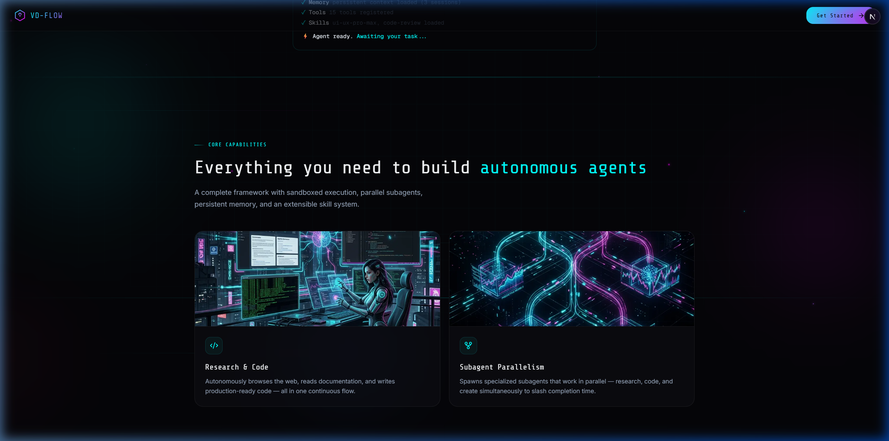
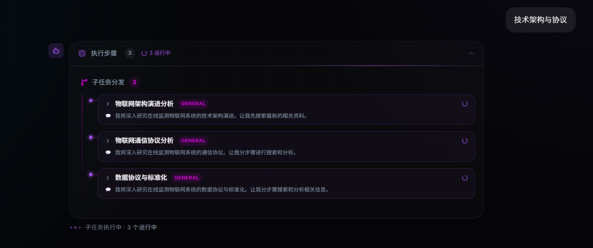
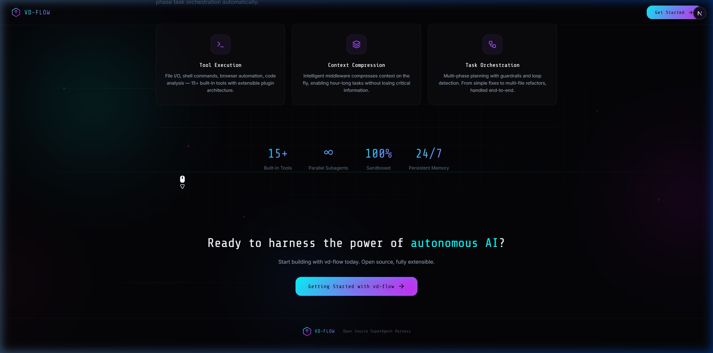

<p align="center">
  
</p>

<h1 align="center">VD-HARNESS</h1>

<p align="center">
  <strong>An open-source SuperAgent harness that researches, codes, and creates.</strong>
</p>

<p align="center">
  <a href="#english">English</a> · <a href="#中文">中文</a>
</p>

---

<a id="english"></a>

## English

### What is VD-HARNESS?

VD-HARNESS is an open-source SuperAgent harness for long-running knowledge work: research, coding, planning, execution, and artifact delivery in one continuous loop.

It combines sandboxed execution, persistent memory, tools, skills, and parallel subagents behind a LangGraph-based runtime, then exposes that runtime through a modern Next.js workspace.

> Current naming status: the product brand is `VD-HARNESS`, while some internal package names and directories still use `vdflow`. This README follows the external brand and only mentions `vdflow` where implementation details matter.

<p align="center">
  
</p>

### Key Capabilities

| Capability | What it means |
|------------|---------------|
| Parallel Subagents | Delegate work to specialized subagents and stream their progress back into the lead conversation |
| Sandboxed Execution | Isolated per-thread workspace, uploads, and outputs boundaries for safer tool use |
| Persistent Memory | Store and re-inject useful context across sessions |
| Skills System | Load reusable Markdown-defined capabilities into the agent at runtime |
| Tool Runtime | Built-in web, file, bash, browser, and task-oriented tools with runtime controls |
| Workspace UI | Landing page, chat workspace, execution timeline, artifacts drawer, todos, thread search, and settings |
| Agent Profiles | Create and reuse custom agents backed by `agents/<name>/config.yaml` and `SOUL.md` |
| Middleware Guardrails | Clarification-first prompting, context compression, loop detection, title generation, and LLM error handling |

<p align="center">
  
</p>

### Workspace Experience

The current workspace is built around real agent execution rather than a static demo shell. It already exposes:

- Streaming chat with thinking, tool, and subtask updates
- Execution steps with expandable subtask cards and runtime status
- Artifact browsing and download from thread outputs
- Todo tracking for long-running tasks
- Thread management with rename, delete, search, and share
- Agent selection, creation, and profile editing in the workspace

<p align="center">
  
</p>

### Quick Start

#### Requirements

- Python 3.10+
- Node.js 18+
- At least one model API key

#### 1. Clone and install

```bash
git clone https://github.com/qiqi-feeder/VD-HARNESS.git
cd VD-HARNESS

pip install -r requirements.txt

cd workspace-frontend
npm install
cd ..
```

#### 2. Configure environment

Backend:

```bash
cp .env.example .env
```

Frontend:

```bash
cp workspace-frontend/.env.example workspace-frontend/.env.local
```

Then edit `.env` and add at least one valid API key. The default frontend API target is `http://127.0.0.1:8000`.

#### 3. Configure models

`config.yaml` is the source of truth for available models. A minimal JD Cloud example:

```yaml
models:
  - name: deepseek-v3.2-jd
    display_name: DeepSeek V3.2 (JD Cloud)
    use: langchain_openai:ChatOpenAI
    model: DeepSeek-V3.2
    api_key: $JDCODING_API_KEY
    base_url: https://modelservice.jdcloud.com/coding/openai/v1
    max_tokens: 8192
```

#### 4. Run

```bash
# Terminal 1: backend
python run.py

# Terminal 2: frontend
cd workspace-frontend
npm run dev
```

Open `http://localhost:3000`. The landing page routes into the workspace at `/workspace/chats/new`.

### Project Structure

```text
VD-HARNESS/
├── vdflow/                 # Core Python runtime package (internal name kept for now)
│   ├── agent/              # Lead agent, prompts, state, middleware
│   ├── subagents/          # Parallel subagent execution
│   ├── memory/             # Persistent memory
│   ├── tools/              # Built-in tools and task dispatch
│   ├── skills/             # Skill loading and injection
│   └── web/                # FastAPI app and streaming endpoints
├── workspace-frontend/     # Next.js workspace and landing UI
├── agents/                 # Custom agent profiles
├── skills/                 # Public and custom skills
├── docs/images/            # README screenshots
├── config.yaml             # Runtime configuration
└── run.py                  # Local startup entry
```

### Supported Model Providers

The checked-in `config.yaml` currently includes these providers or endpoints:

| Provider | Example models | Key |
|----------|----------------|-----|
| OpenAI | GPT-4o Mini | `$OPENAI_API_KEY` |
| Anthropic | Claude 3.5 Sonnet | `$ANTHROPIC_API_KEY` |
| JD Cloud Coding Plan | DeepSeek V3.2, GLM-5, GLM-4.7, MiniMax M2.5, Kimi K2.5, Kimi K2 Turbo, Qwen3-Coder | `$JDCODING_API_KEY` |
| Local OpenAI-compatible endpoint | vLLM-style deployment | custom `api_key` / `base_url` |

<p align="center">
  
</p>

### License

MIT

### Acknowledgements

Inspired by [DeerFlow](https://github.com/bytedance/deer-flow). VD-HARNESS takes the general agent-runtime direction seriously, but is being shaped into its own sandboxed, workspace-first product.

---

<a id="中文"></a>

## 中文

### 什么是 VD-HARNESS？

VD-HARNESS 是一个开源的 SuperAgent harness，面向长链路知识工作：调研、编码、规划、执行和产物交付可以在同一条连续流程里完成。

它把沙箱执行、持久记忆、工具、技能和并行子智能体组合在一个基于 LangGraph 的运行时里，再通过一个现代化的 Next.js Workspace 暴露出来。

> 当前命名状态：对外产品名已经统一为 `VD-HARNESS`，但部分内部包名和目录名仍然保留 `vdflow`。本 README 按品牌名书写，只在实现细节必须说明时提到 `vdflow`。

### 核心能力

| 能力 | 含义 |
|------|------|
| 并行子智能体 | 把任务分发给专用子智能体，并把执行进度实时回流到主对话 |
| 沙箱隔离 | 按线程隔离 `workspace / uploads / outputs`，降低工具执行串扰 |
| 持久记忆 | 跨会话存储并回注高价值上下文 |
| 技能系统 | 运行时加载 Markdown 定义的可复用能力 |
| 工具运行时 | 内置 web、file、bash、browser、task 等工具，并支持运行时开关 |
| Workspace UI | 已落地 landing、聊天工作台、执行步骤、产物抽屉、todo、线程搜索和设置 |
| Agent Profiles | 支持创建和复用自定义 Agent，落盘为 `agents/<name>/config.yaml` 与 `SOUL.md` |
| 中间件护栏 | 包含先澄清后执行、上下文压缩、循环检测、标题生成和 LLM 错误处理 |

### 当前工作台体验

现在的 Workspace 已经不是静态聊天壳，而是围绕真实 Agent 执行构建，当前可见能力包括：

- 流式聊天，支持 thinking、tool、subtask 过程展示
- 执行步骤时间线，支持展开子任务卡片和查看运行状态
- 从线程产物中浏览和下载 artifact
- 面向长任务的 todo 跟踪
- 线程的重命名、删除、搜索与分享
- 在工作台内选择、创建和编辑 Agent Profile

### 快速开始

#### 环境要求

- Python 3.10+
- Node.js 18+
- 至少一个可用模型的 API Key

#### 1. 克隆并安装

```bash
git clone https://github.com/qiqi-feeder/VD-HARNESS.git
cd VD-HARNESS

pip install -r requirements.txt

cd workspace-frontend
npm install
cd ..
```

#### 2. 配置环境变量

后端：

```bash
cp .env.example .env
```

前端：

```bash
cp workspace-frontend/.env.example workspace-frontend/.env.local
```

然后编辑 `.env`，至少填入一个有效模型密钥。前端默认请求后端 `http://127.0.0.1:8000`。

#### 3. 配置模型

可用模型以 `config.yaml` 为准。一个最小的京东云示例：

```yaml
models:
  - name: deepseek-v3.2-jd
    display_name: DeepSeek V3.2 (JD Cloud)
    use: langchain_openai:ChatOpenAI
    model: DeepSeek-V3.2
    api_key: $JDCODING_API_KEY
    base_url: https://modelservice.jdcloud.com/coding/openai/v1
    max_tokens: 8192
```

#### 4. 启动

```bash
# 终端 1：后端
python run.py

# 终端 2：前端
cd workspace-frontend
npm run dev
```

打开 `http://localhost:3000`。落地页会引导进入 `/workspace/chats/new`。

### 项目结构

```text
VD-HARNESS/
├── vdflow/                 # 当前仍沿用的核心 Python 包名
│   ├── agent/              # Lead agent、prompt、state、middleware
│   ├── subagents/          # 并行子智能体执行
│   ├── memory/             # 持久记忆
│   ├── tools/              # 内置工具与任务派发
│   ├── skills/             # 技能加载与注入
│   └── web/                # FastAPI 应用与流式接口
├── workspace-frontend/     # Next.js 工作台与落地页
├── agents/                 # 自定义 Agent Profiles
├── skills/                 # 公共与自定义技能
├── docs/images/            # README 截图资源
├── config.yaml             # 运行时配置
└── run.py                  # 本地启动入口
```

### 当前支持的模型提供方

以仓库内的 `config.yaml` 为准，当前已经配置了这些提供方或端点：

| 提供方 | 示例模型 | 密钥 |
|--------|----------|------|
| OpenAI | GPT-4o Mini | `$OPENAI_API_KEY` |
| Anthropic | Claude 3.5 Sonnet | `$ANTHROPIC_API_KEY` |
| 京东云 Coding Plan | DeepSeek V3.2、GLM-5、GLM-4.7、MiniMax M2.5、Kimi K2.5、Kimi K2 Turbo、Qwen3-Coder | `$JDCODING_API_KEY` |
| 本地 OpenAI 兼容端点 | vLLM 一类本地部署 | 自定义 `api_key` / `base_url` |

### 许可证

MIT

### 致谢

项目方向受 [DeerFlow](https://github.com/bytedance/deer-flow) 启发，但 VD-HARNESS 的目标不是做一个换皮版本，而是做成一个以沙箱执行和 Workspace 体验为核心的通用 Agent 产品。
